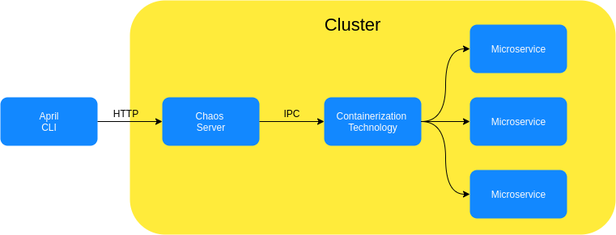

# April
**April is under construction**  

April proposes improve resilience in microservices architectures. It
does chaos testing by randomly shutting down nodes, taking into account 
their importance.  
April is a CLI tool, being possible to either run chaos testing or others tools,
such as 'server' which hosts an API for remote access to the chaos test.
The selection algorithm firstly picks K nodes, then it picks N dependencies on those nodes. Heavy nodes are more likely to be picked.  

## Tools
Chaos test. 
Need a running 'chaos server' to terminate instances.  
-f configuraion file path (Default is conf.yml)  
-n number of nodes to choose  
-c chaos server endpoint (Default is localhost:7071)  
-u username for chaos server auth  
-s password for chaos server auth  
```bash 
april -f conf.yml -n 10 -u bob -s mysecret
```  

*Bare* runs only the selection algorithm, returning a set of nodes.  
-f configuraion file path  
-n number of nodes to choose  
```bash 
april bare -f conf.yml -n 10  
```  

*Server* hosts an API (HTTP) which apply chaos testing and bare algorithm.
Need a running 'chaos server' to terminate instances.  
-p port number (Default is 7070)  
-c chaos server endpoint (Default is localhost:7071)  
```bash 
april server -p 8080  // will listen on port 8080
``` 
## Configuration file template
```yaml
services:
    servicename:
        weight: Any integer
        dependencies:
            - list of services
```  

### Configuration file example  
> conf.yml
```yaml
services:
    payment:
        weight: 10
        dependencies:
            - "profile"
            - "fees"
    fees:
        weight: 5
    profile:
        weight: 20
    inventory:
        weight: 15
    shipping:
        weight: 5
        dependencies:
            - "inventory"
            - "profile"
    storefront:
        weight: 20
        dependencies:
            - "shipping"
            - "inventory"
            - "profile"
            - "payment"
            - "fees"
```

## Design approach 
The Aprils design is divided into two parts: CLI and Chaos server. CLI runs the algorithm and request to Chaos server for terminate instances. 
Therefore, we gain flexibility about technologies that manage instances, a Chaos server could terminate Docker containers, Kubernetes instances etc.  

  

## What is a Chaos server ?
Chaos server hosts an API that terminantes instances. Aprils CLI runs its algorithm and asks the Chaos server to finish 
the selected instances. The API implementation lives in april/destroyer package, so chaos servers must include that package and
implement the Destroyer interface, which contain the business logic for terminate instances. 

## Chaos Servers
Docker chaos server stop containers [dockercs](https://github.com/barbosaigor/aprilcsdocker).  
Kubenetes chaos server terminate pods [kubernetescs](https://github.com/barbosaigor/aprilcsdocker), in future it may terminate deployments and services.  
