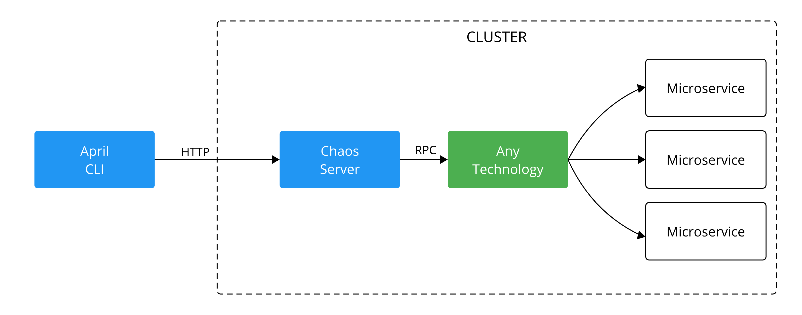

# April

April proposes to improve resilience in microservices architectures. It
does chaos testing by randomly shutting down services, taking into account their importance.  
April is similar to other tools, such as Chaos Monkey, Pumba, and Gremlin.
But it differs by the selection algorithm, which considers services importances (weights).
The selection algorithm firstly picks K services, then it picks N dependencies on those services. Heavy services are more likely to be picked.  
A Chaos Server must be running to terminate instances, for that, we already have a Docker and Kubernetes Chaos Servers implementations. 
Though, due to April's design, a Chaos Server could easily do anything, such as terminating VMs, overloading a server, turning off a service network, 
or even destroying the world (this is very dangerous).  

## Why should I use April?  
In a microservice architecture, we want to make sure that all services are fault-tolerant, primarily critical services.   
The main goal of April is to direct your team energy to critical microservices, without losing the randomness needed to simulate unexpected failures in production.  
So if we want to test if a service is fault-tolerant, we should nudge its dependencies by terminating some of them. That is what April is about, it terminates services dependencies.  

## Installation  
```bash 
go get -u github.com/barbosaigor/april/...
```   

## Design approach 
April's design is split into two parts: April CLI and Chaos Server (CS). April CLI runs the algorithm and requests to Chaos Server to terminate instances. 
Therefore, we gain flexibility about technologies that manage instances. A Chaos server could terminate Docker containers, Kubernetes instances, and so on.  

  
*(Architecture) Eg. A Chaos Server implementation using a containerization technology, such as Docker*

## What is a Chaos Server ?
Chaos server hosts an API which terminates instances. It is used by April, 
which runs its algorithm and asks the Chaos Server to finish any selected instances. 
All Chaos Servers implementations must implement the interface defined in april/destroyer package, so CSs must include that package and
implement the Destroyer interface, where the business logic to terminate instances should be defined.  

## Chaos Servers
Docker chaos server stop containers [dockercs](https://github.com/barbosaigor/dockercs).  
(Under development) Kubernetes chaos server terminates pods [kubernetescs](https://github.com/barbosaigor/kubernetescs), in future it may terminate deployments and services.  

## Tools
Chaos test. 
Need a running 'chaos server' to terminate instances.  
-f configuraion file path (Default is conf.yml)  
-n maximum number of services to choose  
-c chaos server endpoint (Default is localhost:7071)  
-u username for chaos server auth  
-s password for chaos server auth  
```bash 
april -f conf.yml -n 10 -u bob -s mysecret
```  

*Bare* runs only the selection algorithm, returning a set of services.  
-f configuraion file path  
-n maximum number of services to choose  
```bash 
april bare -f conf.yml -n 10  
```  

*Server* hosts an API (HTTP) which apply chaos testing and bare algorithm.
Need a running 'chaos server' to terminate instances.  
-p port number (Default is 7070)  
-c chaos server endpoint (Default is localhost:7071)  
```bash 
april server -p 8080  // will listen on port 8080
``` 
## Configuration file
*Fields*  
_version_: could be omitted, default is 1   
_services_: describes a list of services  
_servicename_: is the name of a service that April is going to work  
_weight_: represents the service importance for the April pick algorithm  
_depedencies_: describe a list of services which the service depends  
_selector_: describe how Chaos Server must search for the service name. 
E.g If you are using Docker containers and a framework such as Docker Compose,
Compose will define the container name as a concatenation between your service name and a hash somewhere, in this case, it is better to look for the _infix_ corresponding to the service.  

```yaml
# template
version: 1
services:
    servicename:
        weight: [0-9]+ (any natural number)
        dependencies:
            - [a-zA-Z\_\-]* (dependency name)
        selector: prefix|infix|postfix|all (how should match the service name instance)
```  

*Example conf.yaml*  
```yaml
version: 1
services:
  payment:
    weight: 10
    dependencies:
      - profile
      - fees
    selector: postfix  

  fees:
    weight: 5
    selector: infix  

  profile:
    weight: 20
    selector: infix  

  inventory:
    weight: 15
    selector: infix  

  shipping:
    weight: 5
    dependencies:
      - inventory
      - profile
    selector: infix  

  storefront:
    weight: 20
    dependencies:
      - shipping
      - inventory
      - profile
      - payment
      - fees
    selector: infix
```
